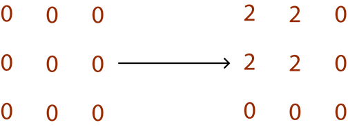
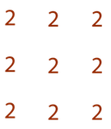
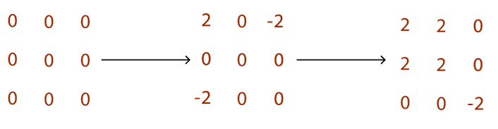
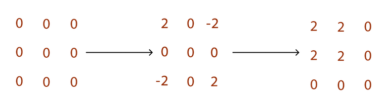

<!-- TOC -->

- [2D Prefix Sums and Difference Arrays](#2d-prefix-sums-and-difference-arrays)
    - [figure 1](#figure-1)
    - [figure 2](#figure-2)
    - [figure 3](#figure-3)
    - [figure 4](#figure-4)
    - [Implementation](#implementation)

<!-- /TOC -->
# 2D Prefix Sums and Difference Arrays
In the last lesson's problem ,[wireless](http://wcipeg.com/problem/ccc09s5), we needed to use single dimension Difference Array because they give us a circle. But what if they give us a box to update? Is it possible to create something that does not require us to loop through every array and set one value to += increment and the other to -= the same increment? <!-- شو؟ -->

```
0 1 [2 3] 4 5
6 7 [8 9] 0 1
2 3 [4 5] 6 7
```
<!-- شو؟ -->
Now, every number represents the sum of all items in the array until its index, inclusive. But we want it to represent the sum of the box from the start to itself. To do this, we will add up all the items in each array with the same index.

Now, every number represents the sum of all items in the array until its index, inclusive. But we want it to represent the sum of the box from the start to itself. To do this, we will add up all the items in each array with the same index.
```
0 1 [3 6] 10 15
6 14 [24 36] 40 46
8 19 [33 50] 60 73
```
So, we went from
```
[
 [A, B, C],
 [D, E, F],
 [G, H, I]
]
```
To
```
[
 [A, A+B, A+B+C],
 [A+D, A+B+D+E, A+B+C+D+E+F],
 [A+D+G, A+B+D+E+G+H, A+B+C+D+E+F+G+H+I]
]
```
Any given point is the sum of all the items in all the arrays up until its index. This gives us a “box”. If we want to get the sum of anything within a box **(X1,Y1)** to **(X2,Y2)**, we would get the box of **(X2, Y2)**, remove the extra box from the left **(X1-1,Y2)**, remove the extra box from the top **(X2, Y1-1)**, and add in the box removed twice **(X1-1,Y1-1)**. If any of these points do not exist, the sum of the box is 0 for that point.

So in our example, we needed to find the sum in this box:
```
0 1 [2 3] 4 5
6 7 [8 9] 0 1
2 3 [4 5] 6 7
```
We apply the prefix sums to this, and turn it to
```
0 1 [3 6] 10 15
6 14 [24 36] 40 46
8 19 [33 50] 60 73
```
This allows us to get the sum: 50 - 19 - 0 + 0 = 31

So, that is how we could apply prefix sums in 2D lists for a “box”. But what about Difference Arrays? How can we increment the values of every item in a box without looping through every item, or even just every array? Well, Difference Arrays is an algorithm that lets us update an array, while knowing that the prefix sum algorithm will be applied at the end to give us the values we want. That is how we increment minimal values. So let's look at our 2D prefix sums again.
```
[
 [A, A+B, A+B+C],
 [A+D, A+B+D+E, A+B+C+D+E+F],
 [A+D+G, A+B+D+E+G+H, A+B+C+D+E+F+G+H+I]
]
```
How can we increment the box by X?
```
[
 [A, B], C,
 [D, E], F,
  G, H , I]
]
```
 Let us assume that all values are 0, and that **X** is 2. That means we need to go like illustrated in [Fig. 1](##figure-1).
## figure 1


We start by incrementing the array at **X1,Y1** by 2 (the value of **X**). After applying 2D prefix sums to it, we will end up having a list like in [Fig. 2](##figure-2).
## figure 2


That is because we set everything from **X1,Y1** to increment by **X**, but did not have any limits. In this case, **(X1,Y1)** is **(0,0)** and **(X2,Y2)** is **(1,1)**, which is E in the diagram. First, we want to end the increment at **(X2,Y1)** to stop it from going too far to the right. That means we increment **(X2+1, Y1)** by **X**\*-1. We will also have to increment **(X1, Y2+1)** by **X**\*-1. That is to stop the increment from touching anything outside the box. Now, our values look in [Fig. 3](##figure-3)
## figure 3


The reason the -2 is there is because it’s still affected by the increment at **(X1,Y2+1)**. We will have to cancel that increment at **(X2+1,Y2+1)** with an increment of **X**. That gives the final result illustrated in [Fig. 4](##figure-4)
## figure 4


Now let's take up a question. [The Cake is a Dessert](http://wcipeg.com/problem/cake).
## Implementation