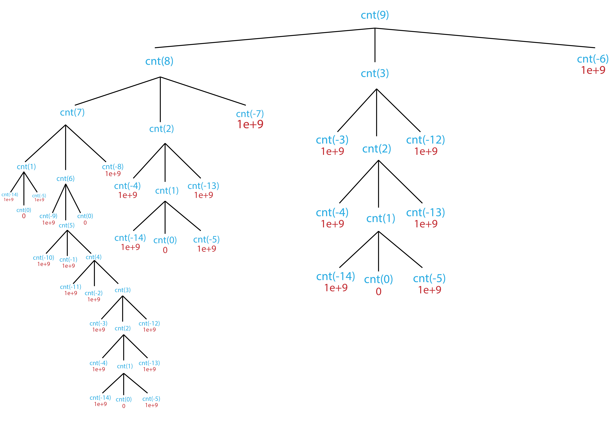

**Table Of Contents**
<!-- TOC -->

- [Dynamic Optimization](#dynamic-optimization)
    - [Sample problem](#sample-problem)
        - [The Greedy Solution](#the-greedy-solution)
        - [Pure Recursion Implementation](#pure-recursion-implementation)
        - [figure 1](#figure-1)
    - [Memoization](#memoization)
        - [Implementation](#implementation)
    - [Bottom-up](#bottom-up)
        - [Implementation](#implementation-1)

<!-- /TOC -->

# Dynamic Optimization
Recursion might be a "cool" way of doing iterative and not so iterative stuff, but sometimes recursion does some unnecessary computations.

## Sample problem

Let’s say I have three different denominations of coins:
+ 1 cent
+ 6 cents
+ 15 cents

Given a certain amount of money (in cents), what is the minimum number of coins needed?

### The Greedy Solution

Greedy algorithm works by choosing what looks like the best possible state at any given point, in the problem
Coin problem → choose the highest coin that can be taken out of the amount, repeat until amount is 0
Greedy algorithms work on many problems, but this is not one of them.

**Example**: greedy algorithm on 18 cents will yield

    15 + 1 + 1 + 1 → 4
Optimal solution is

     6 + 6 + 6 → 3
### Pure Recursion Implementation
+ The base case spoonful is zero
+ The current value can be broken down into one plus the minimum of the function called on the current value - 1, the current value - 6, and the current value - 15

```python
def cnt(number :int):
    if number == 0:
        return 0
    if number < 0:
        return 1e+9
    return 1 + min([cnt(number-1),cnt(number-6),cnt(number-15)])
```
**Cases**:
+ 1 : 1
+ 5 : 5
+ 6 : 1
+ 10: 5
+ 18: 3
+ 100: 10 `This one takes approximately 6 years of computation in pure recursion`

As you can see this is extremely inefficient as it has ,asymptotically, __*O*(3ⁿ)__ time complexity. A lot of the computations are repeated, see [Fig.1](#figure-1)
### figure 1

**cnt(3)** subtree is computed twice, **cnt(2)** is computed thrice and their subtrees are computed even more. For larger inputs this throttles the algorithm dramatically making it extremely inefficient.
## Memoization
Most of the computations are calculated more than once which is unnecessary. The solution is `memoizing` ,a type of dynamic optimization, and as the name suggests the recursive algorithm is set up to realize overlapping solution subtrees.

To optimize a recursive solution to a memoized one you need:
+ A cup of hash-map or list of previous computations
+ A spoonful of saving computations to previous computations if they aren't already, if they are just return the key in the hash
### Implementation
```python
cache = [1e+9 for i in range(5000)] # Since we are comparing mins fill list with arbitrarily large numbers

def memCnt(number :int):
    if cache[number] > 1e+9:
        return cache[number]
    elif number == 0:
        return 0
    elif number < 0:
        return 1e+9
    # The memoization
    if cache[number] == 1e+9:
        cache[number] = 1 + min([cnt(number-1),cnt(number-6),cnt(number-15)])
        return cache[number]
    else:
        return cache[number]
```
And Tadaa! passing in 100 runs in no time.

## Bottom-up
Sometimes the function overhead exceeds the recursion depth in the stack, even if it is memoized. The workaround is coming up with a bottom up solution that starts at the tree's farthest child instead of the argument as a parent.

So we will initialize the cache list except start at `cache[0] = 0` and work your our up:

```
cache[1] is cache[0] + 1
cache[2] is cache[1] + 1
⠇
cache[10] is min(cache[4] + 1, cache[9] + 1)
⠇
cache[18] is min(cache[17] + 1, cache[12] + 1, cache[3] + 1)
⠇
etc.
```
### Implementation
```python
def buCnt(number :int):
    cache = [1e+9 for i in range(5000)]
    cache[0] = 0
    for i in range(1,a+1):
        if i >= 1:
            cache[i] = min(cache[i], cache[i-1] + 1)
        if i >= 6:
            cache[i] = min(cache[i], cache[i-6] + 1)
        if i >= 15:
            cache[i] = min(cache[i], cache[i-15] + 1)
    return cache[number :int]
```
Now if you pass in 2e+9 it will take its time ,but it will never run out of stack space due to the absence of recursion and function overhead.