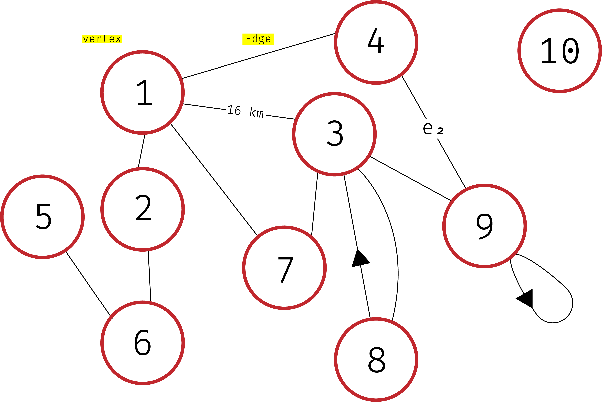
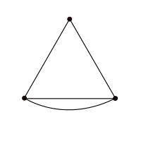
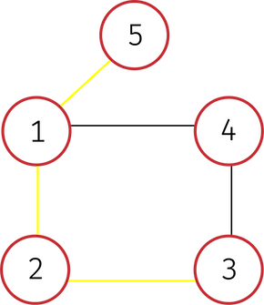
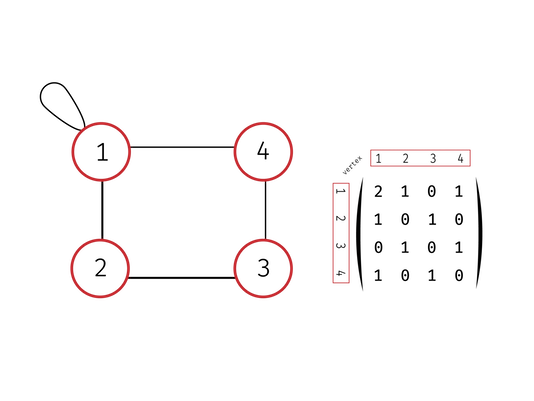
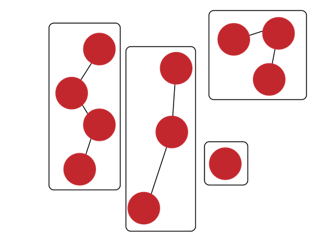

**Table Of Conetents**
<!-- TOC -->

- [Graph Theory Intro](#graph-theory-intro)
        - [Figure 1](#figure-1)
    - [A node](#a-node)
    - [An Edge](#an-edge)
        - [Figure 2](#figure-2)
        - [Figure 3](#figure-3)
    - [graph terminology](#graph-terminology)
    - [ways to implement a graph](#ways-to-implement-a-graph)
        - [Figure 4](#figure-4)
    - [Trees](#trees)
    - [Connected components](#connected-components)
        - [Figure 5](#figure-5)

<!-- /TOC -->

# Graph Theory Intro

A graph data structure consists of a finite , *and possibly mutable*, set of ordered pairs, called edges or arcs, of certain entities called nodes or vertices. A graph is represented by a pair of two sets `G<V, E>`
where `V` is the set of vertices and `E` is the set of edges

### Figure 1

## A node
Represented as a little circle (Red in fig. 1).
+ A `Degree` or `Valency` denoted 𝛿(v) is how many edges are connected to a node
>Count loops as 2 edges in valency
+ `Isolated node` is a node with degree 0 (in [Fig. 1](#figure-1) node 10)
+ `adjacent vertices`  to a node are vertices that are directly connected to it. ex -> [Fig. 1](#figure-1) node (2) has an adjacency array Adj[2] = [1,6]

## An Edge
Represented as a line connecting nodes.
+ an edge (e) is `incedent` to node(a) and node(b) if i connects them
+ A `Loop` is an edge that points to the node itself (node 9 in [Fig. 1](#figure-1))
+ An edge can be parallel to another `multigraphs` edges that are parallel to another edge have a multiplicity of 2 (In [Fig. 1](#figure-1) edge connecting node 3 and node 8 )
+ `Weighted graphs` have distances on their edges (In [Fig. 1](#figure-1) edge connecting node 1 and node 3)
+ `directed graphs` have directed edges like (In [Fig. 1](#figure-1) edge connecting node 3 and node 8)
+ `cycle` is a path of edges that go in a 'cycle' back to the starting node

>[Fig. 2](#figure-2) is an example of a connected graph
+ a graph's `diameter` is the longest shortest path in a connected graph without backtracking or repeating edges or nodes, refer to the yellow path in [Fig. 3](#figure-3).

### Figure 2

### Figure 3

## graph terminology
+ A `undirected` graph is a graph with edges represented as sets of 2 vertices (unordered) e = {a, b}. A `directed` graph is a graph with edges represented as ordered pairs (tuples) e' = (a,b).
Most graphs are either are directed or undirected but a mix of both also exists

>[Fig. 1](#figure-1) is neither directed nor nondirected graph
>because not all vertecies are directed like the node
>connecting node 3 and node 8.

+ A graph is connected if there is an x,y path for x, y ∈ V

>[Fig. 1](#figure-1) is an example of a disconnected graph.

<!-- + `Walk` is a sequence of vertices and edges

> `closed walk` is a walk that starts at a node and returns to it

> `trivial walk` is a walk that goes through no edges (one node)

+ `Trail` is a walk with no repeated edges

>a closed trail is called a `circiut`

+ `Path` a walk with no repeated vertices

>a closed path is a `cycle`. The first and the last node can be repeated -->

## ways to implement a graph

+ `Adjacency list` -> an array of size V with each element in the array pointing to a linked list. The array is indexed by a node (vertices from 0 to v-1) or a hash. where each index or key points to alinked list of adjacent verticies

+ `Adjacency Matrix` -> a (0,1)-matrix represented by

a [#of nodes ⨉ # of nodes] 2D-array
> [Fig. 4](#figure-4) represents a graph and it's Adjacency matrix where the array at Adj[i][j] represents edge between i and j and the number denotes the multiplicity of the edges.

### Figure 4

+ `OPP approach` -> where node is an object and has the attribute neighbours which stores the linked list

+ `Implicit` -> where the adjacency of a node is a function or node.neghbours() is a method (which takes less space if you aren't going to use all verticies)

**Ignoring the implicit representation you need Θ(V + E) space to store graph**

## Trees
A `tree` is a connected graph with no trees The edges of a tree are known as branches. Elements of trees are called their nodes. The nodes without child nodes are called leaf nodes. a disjoint collection of trees is called a `forest`.

## Connected components
A `component` of an undirected graph is a subgraph that is completely disconnected than the other components
>[Fig. 5](#figure-5) shows a graph with 4 components

### Figure 5

