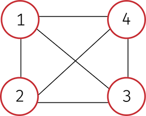

**Table Of Conetents**
<!-- TOC -->

- [Graph Theory Intro](#graph-theory-intro)
    - [graph terminology](#graph-terminology)
        - [Figure 1](#figure-1)
        - [Figure 2](#figure-2)
        - [Figure 3](#figure-3)
    - [A node](#a-node)
    - [An Edge](#an-edge)
    - [ways to implement a graph](#ways-to-implement-a-graph)

<!-- /TOC -->

# Graph Theory Intro

A graph data structure consists of a finite , *and possibly mutable*, set of ordered pairs, called edges or arcs, of certain entities called nodes or vertices. A graph is represented by a pair of two sets `G<V, E>`
where `V` is the set of vertices and `E` is the set of edges

<!-- why e' -->

## graph terminology
+ A `undirected` graph is a graph with edges represented as sets of 2 vertices (unordered) e = {a, b}. A `directed` graph is a graph with edges represented as ordered pairs (tuples) e' = (a,b).
Most graphs are either are directed or undirected but a mix of both also exists

>[Fig. 1](#figure-1) is neither directed nor nondirected graph
>because not all vertecies are directed like the node
>connecting node 4 and node 9.

+ A graph is connected if there is an x,y path for x, y ∈ V

>[Fig. 1](#figure-1) is an example of a disconnected graph.

>[Fig. 2](#figure-2) is an example of a connected graph
+ a graph's `diameter` is the longest shortest path in a connected graph without backtracking or repeating edges or nodes.

### Figure 1

### Figure 2

### Figure 3

## A node
Represented as a little circle (Red in fig. 1).
+ A `Degree` or `Valency` denoted 𝛿(v) is how many edges are connected to a node
>Count loops as 2 edges in valency
+ `Isolated node` is a node with degree 0 (in [Fig. 1](#figure-1) node 10)
+ `adjacent vertices`  to a node are vertices that are directly connected to it. ex -> [Fig. 1](#figure-1) node (2) has an adjacency array Adj[2] = [1,6]

## An Edge
Represented as a line connecting nodes.
+ an edge (e) is `incedent` to node(a) and node(b) if i connects them
+ A `Loop` is an edge that points to the node itself (node 9 in [Fig. 1](#figure-1))
+ An edge can be parallel to another `multigraphs` edges that are parallel to another edge have a multiplicity of 2 (In [Fig. 1](#figure-1) edge connecting node 3 and node 8 )
+ `Weighted graphs` have distances on their edges (In [Fig. 1](#figure-1) edge connecting node 1 and node 3)
+ `directed graphs` have directed edges like (In [Fig. 1](#figure-1) edge connecting node 3 and node 8)

+ `Walk` is a sequence of vertices and edges

> `closed walk` is a walk that starts at a node and returns to it

> `trivial walk` is a walk that goes through no edges (one node)

+ `Trail` is a walk with no repeated edges

>a closed trail is called a `circiut`

+ `Path` a walk with no repeated vertices

>a closed path is a `cycle`. The first and the last node can be repeated

## ways to implement a graph

+ `Adjacency list` -> an array of size V with each element in the array pointing to a linked list. The array is indexed by a node (vertices from 0 to v-1) or a hash. where each index or key points to alinked list of adjacent verticies

+ `OPP approach` -> where node is an object and has the attribute neighbours which stores the linked list

+ `Implicit` -> where the adjacency of a node is a function or node.neghbours() is a method (which takes less space if you aren't going to use all verticies)

>Ignoring the implicit representation you need at best Θ(V + E) space
