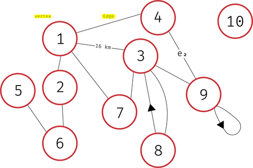

# Graph Theory Intro

A graph data structure consists of a finite , *and possibly mutable*, set of ordered pairs, called edges or arcs, of certain entities called nodes or vertices. A graph is represented by a pair of two sets `G<V, E>`
where V is the set of vertices and E is the set of edges

<!--TL;DR a graph is formed by vertices and edges connecting the vertices -->

+ ### A Vertex
    Represented as a little circle.
    + A `Degree` or `Valency` denoted 𝛿(v) is how many edges are connected to a node
    + Count loops as 2 edges in valency
    + `Isolated vertex` is a vertex with degree 0
    + an `Induced subgraph` is a graph segment created by all `adjacent` vertices to a vertex

+ ### An Edge
    Represented as a line connecting nodes.
    + an edge (e) is `incedent` to vertex(a) and vertex(b) if i connects them
    + A `Loop` is an edge that points to the vertex itself
    + An edge can be parallel to another (multigraphs)
    + Can have a distance attribute
    + Can have distances ( Weighted graphs)
    + Can have direction (directed graphs)

+ ### Also
    + `Walk` is a sequence of vertices and edges
    + `Path` a walk with no repeated vertices
    + `Trail` is a walk with no repeated edges

### Some graphs

#### A multi graph
