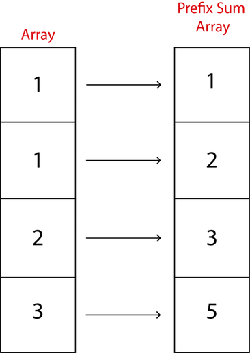

<!-- TOC -->

- [Prefix Sums](#prefix-sums)
    - [figure 1](#figure-1)
    - [Implementation](#implementation)

<!-- /TOC -->
# Prefix Sums
Given a question like [Lil jami](http://wcipeg.com/problem/liljami), you would repeatedly have to find the sum of a portion of your array.
You would find it fairly easy to complete the question. But to make runtime minimal, that is a different story. The general
idea is to have an array (or list) of length N, and update its values as the input is given. Then, repeatedly output the sum of the
items in the portion they ask for. That is rather inefficient though, as you will perform *O*(N*K) operations, which could be up to
1e+12 (in Lil jami’s case).That is where the need of an algorithm comes in. The goal is to change your array, so that you will perform minimal operations once
asked to.
## figure 1


 Given an array `[a, b, c, d]`, we can convert each item to be the sum of all the items before it and itself. This changes our array to `[a, a+b, a+b+c, a+b+c
 +d]`. With this new array, simply subtract to find the sum wanted.
> Example array in figure 1 [Fig. 1](##figure-1)

**Example:** If we wanted to find the value of c+d
```python
# (a+b+c+d) - (a+b) = c+d
array[3] - array[1]
```
This leaves us with c+d in a single operation every time it is asked for.
## Implementation
+ __*Looping in the array and += each element to the item behind it*__
```python
# lets say the list is predefined somewhere in the code
for i in range(1,len(prefixList)):
    prefixList[i] += prefixList[i-1]
```

+ __*Making a new list, starting with 0 and adding from the last item*__
```python
newList = [0]
for item in prefixList:
    newList.append(item+newList[-1])
del newList[0]
```