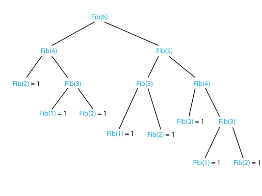
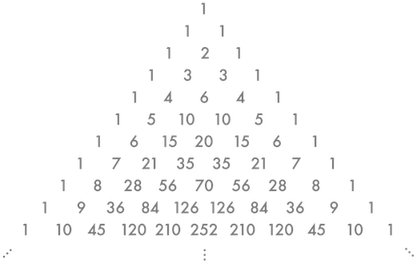

**Table Of Contents**
<!-- TOC -->

- [Recursion](#recursion)
    - [Fibonacci](#fibonacci)
        - [figure 1](#figure-1)
    - [Pascal's triangle](#pascals-triangle)
        - [figure 2](#figure-2)

<!-- /TOC -->

# Recursion
__[see recursion](#Recursion)__

Is breaking a problem down into smaller subproblems.
To cook recursion you need:
+ A spoonful of base case
+ A cup of a self call that approaches the base case

and you will have a working recursive program, bon appétit.

## Fibonacci

The Fib sequence is the classic recursive algorithm in mathematics and computer science, yet not the only one. Fib starts with first and second number being 1 (base cases) and each subsequent number is the sum of the previous 2 numbers.

The implementation of this sequence can be either iterative or recursive. The following is python code for the recursive approach.
> See [Fig. 1](###figure-1) for the call-stack tree
```python
def fib(number :int): # The index of the term you are looking for
    if number == 1 or number == 2:
        return 1
    else:
        return fib(number-2)+fib(number-1) # summ of previous 2 numbers
```

### figure 1


Every node in the recursion tree calls 2 others if it has no return value yet and that goes on until all the tree's vertices hit 1 or 0 which have a return defined as 1. Once all the tree's vertices hit the 0 or 1 node it traces back to the parent node.

## Pascal's triangle

pascal's triangle discrete the fibonacci sequence, the binomial coefficients , natural numbers , triangular numbers and many many more by a very simple idea.The following is python code for recursive pascal's triangle.
> See [Fig. 2](###figure-2) for pascal's triangle

```Python
def pascal(coloumn :int, row :int):
    if coloumn == 0 or row == coloumn:
        return 1
    else:
        return pascal(coloumn - 1, row - 1) + pascal(coloumn, row - 1)
```

### figure 2


To build the triangle, start with "1" at the top with 2 other "1"s under it, then continue placing numbers below it in a triangular pattern.

Each number is the numbers directly above it added together.