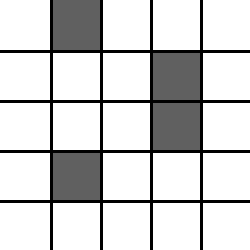
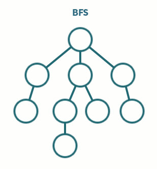
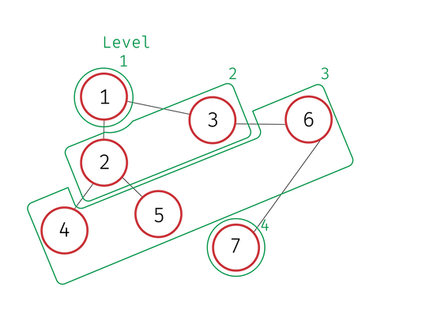
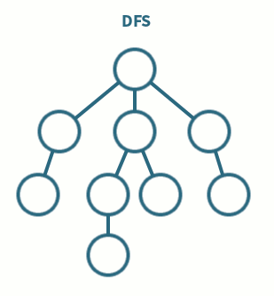

**Table Of Contents**
<!-- TOC -->

- [Graph Search](#graph-search)
    - [Breadth First Search](#breadth-first-search)
        - [figure 1](#figure-1)
        - [Implementation](#implementation)
        - [figure 2](#figure-2)
    - [Depth First Search](#depth-first-search)
        - [figure 3](#figure-3)
        - [Implementation](#implementation-1)
    - [Maze](#maze)

<!-- /TOC -->

# Graph Search
Traversing a graph is one of the very first uses for graphs. The way you implement graph traversal varies depending on what you want to achieve. Some applications include:
+ Web crawling
+ Finding shortest path(s)
+ Maze generation
+ finding all vertices within one connected component

**BFS pathfinding algorithm**


## Breadth First Search
BFS is one of the most famous graph traversal algorithms because of how broad it can search. In other words, BFS explores the starting vertex's neighbors before going to the next level of vertices.
> BFS is shown in [Fig. 1](###figure-1)

### figure 1
**BFS in action**



### Implementation
```python
def bfs(start :object, Adj :dict):
    level  = {start: None} # {vertex: distance to starting vertex (# edges)}
    parent = {start: None} # the parent hash is optional but helps
                           # backtrack for shortest paths

    previous = [start] # what vertices were in the previous
                       # level (resets with each loop)
    i = 1
    while previous:
        next = [] # if there is no next level there is no
                  # previous hash for the next iteration,
                  # resulting in the breakage of the loop
        for vertex in previous:
            for neighbours in Adj[vertex]: # for children of previous vertices
                if neighbours not in level: # if it hasn't already been traversed

                    level[neighbours] = i
                    parent[neighbours] = vertex
                    next.append(neighbours)

        previous = next
        i += 1
# the graph is represented in Fig 2
bfs(start = 1, Adj = {1:{2,3},2:{5,4,1},3:{1,6},4:{2},5:{2},6:{3,7},7:{6}})
```

### figure 2


## Depth First Search
DFS is much more intuitive than BFS in traversal although it is implemented in a recursive approach.
DFS traverses into a child of a starting vertex then goes to it's child and so on until there is no more children then it backtracks.

### figure 3
**DFS in action**



### Implementation
```python
def dfs(Adj :dict, start :object, visited = None):
    if visited is None: # verices we already traversed
        visited = set()
    visited.add(start)
    children = Adj[start] - visited # children of the starting vertex
    for next in children:
        dfs(Adj = Adj, start = next, visited = visited)
    return visited

dfs(Adj = {1:{2,3},2:{5,4,1},3:{1,6},4:{2},5:{2},6:{3,7},7:{6}}, start = 1)
```

## Maze
Realizing what algorithm to use is usually the hardest part of a pathfinding problem. For example [Maze](http://wcipeg.com/problem/ccc08s3) needs a breadth first search algorithm to be solved, yet, it can be solved with DFS but not with optimal efficiency. Since in maze we need to get from point a (**the north west corner**) to point b (**the south east corner**) and find how many intersections we have to cross, the problem boils down to finding the shortest path from a to b.

```python
for i in range(int(input())):
    row  = int(input())
    col  = int(input())
    pizzaMap = [] # The char map

    for j in range(row):
        pizzaMap.append(input())

    possPaths = [(0,0,1)] # tuples of (x, y, intersections)
    traversed = []

    # symbol being (0,0) mapped to the points you can add to it
    moves = {
             '+':[(1,0),(-1,0),(0,1),(0,-1)], # N S E W
             '|':[(0,1),(0,-1)], # N S
             '-':[(1,0),(-1,0)]  # E W
            }

    while True:
        if len(possPaths) == 0: # if Im blocked and can't traverse
            print (-1)
            break

        x,y,intersections = possPaths.pop(0)
        if (x == -1 or x == col) or (y == -1 or y == row):
            continue

        if pizzaMap[y][x] == '*':
            continue

        if (x,y) in traversed:
            continue

        if (x,y) == (col-1,row-1): # we are at the south-east
            # print (intersections)
            break


        traversed.append((x,y))
        symbol = pizzaMap[y][x]

        for (dx,dy) in moves[symbol]: # adding the possibilities
            possPaths.append((x+dx, y+dy, intersections+1))
        print (possPaths)
```
Given more time, converting the array into a graph would make this a matter of slapping a bfs function into it but, most of the questions on the CCC, like Maze, don't come in a structure that is directly translatable into a graph.