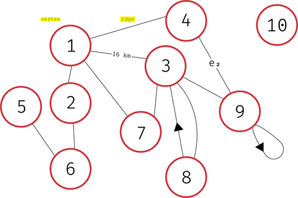
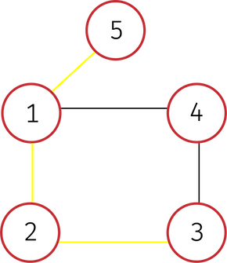
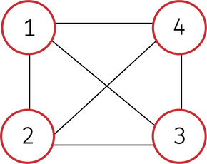
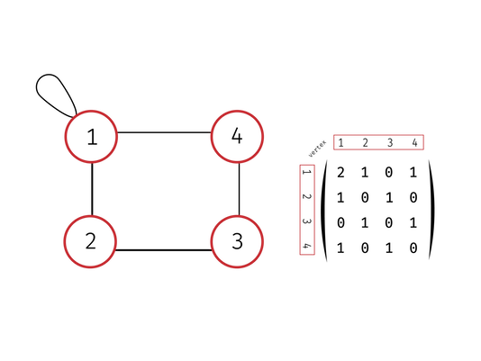
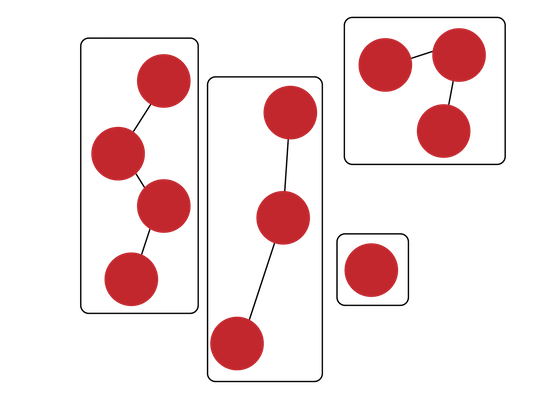

**Table Of Contents**
<!-- TOC -->

- [Graph Theory](#graph-theory)
    - [Figure 1](#figure-1)
    - [A vertex](#a-vertex)
    - [An Edge](#an-edge)
        - [Figure 2](#figure-2)
    - [graph terminology](#graph-terminology)
        - [Figure 3](#figure-3)
    - [ways to implement a graph](#ways-to-implement-a-graph)
        - [Figure 4](#figure-4)
    - [Trees](#trees)
    - [Connected components](#connected-components)
        - [Figure 5](#figure-5)

<!-- /TOC -->

# Graph Theory

A `graph` is a data-structure consisting of objects ,**vertices**, which are connected by **edges**.

## Figure 1

A graph is represented by a pair of two sets **G<V, E>** where **V** is the set of vertices and **E** is the set of edges

## A vertex
(also **node**)

Is an object in the graph connected to other vertices by edge.
>Vertices are represented as circles in [Fig. 1](#figure-1).
+ A `Degree` or `Valency` of a vertex denoted 𝛿(v) is how many edges are connected to a vertex
+ `Isolated vertex` is a vertex with degree 0 (in [Fig. 1](#figure-1) vertex 10)
+ `adjacent vertices`  to a vertex are vertices that are directly connected to it.
>[Fig. 1](#figure-1) vertex **2** has an adjacent vertices **1** and **6**

## An Edge
Edges function as connections between vertices, that may have a weight attribute.
> Represented as a line connecting vertices in [Fig. 1](#figure-1).
+ A `Loop` is an edge that points to the vertex itself
>**Note** : Count loops as 2 edges in valency

>**Example**: vertex **9** in [Fig. 1](#figure-1)
+ An edge can be parallel to other edges. We refer to the number of edges connecting to vertices directly with `multiplicity` of an edge. Graphs containing parallel edges are called `multi-graphs`
>In [Fig. 1](#figure-1) the edge connecting vertex **3** and vertex **8** has multiplicity of 2
+ `Weighted graphs` have a numerical attribute (usually positive) on their edges
>In [Fig. 1](#figure-1) the edge connecting vertex **1** and vertex **3** has weight of 16 Kilometers
+ `directed graphs` have directed edges
>Like in [Fig. 1](#figure-1) the edge (with arrow) connecting vertex **3** and vertex **8**
+ `cycle` is a path of edges that go in a 'cycle' back to the starting vertex
+ a graph's `diameter` is the longest shortest path in a connected graph without backtracking or repeating edges or vertices
>refer to the yellow path in [Fig. 2](#figure-2).
### Figure 2

## graph terminology
+ A `undirected` graph is a graph with edges represented as sets of 2 vertices (unordered) **e = {a, b}**. A `directed` graph is a graph with edges represented as ordered pairs (tuples/arrays) **e' = (a,b)**. Most graphs are either directed or undirected but a mix of both also exists

>[Fig. 1](#figure-1) is neither directed nor undirected graph
+ `Walk` is a sequence of vertices and edges
+ `Path` a walk with no repeated vertices
+ A graph is `connected` when there is a path between every pair of vertices
>[Fig. 3](#figure-3) is an example of a connected graph

>[Fig. 1](#figure-1) is an example of a disconnected graph.

### Figure 3

<!--
> `closed walk` is a walk that starts at a vertex and returns to it
> `trivial walk` is a walk that goes through no edges (one vertex)
+ `Trail` is a walk with no repeated edges
>a closed trail is called a `circiut`
>a closed path is a `cycle`. The first and the last vertex can be repeated
-->

## ways to implement a graph

+ `Adjacency list` is an array of size **V** with each element in the array pointing to a linked list. The array is indexed by a vertex (vertices from 0 to v-1) or a hash. where each index or key points to a linked list of adjacent vertices

+ `Adjacency Matrix` is a matrix (traditionally a 2D array/list) where the element at an index represents the multiplicity of the edge between its indices

> [Fig. 4](#figure-4) represents a graph and it's Adjacency matrix

### Figure 4

+ `OPP approach` is where vertex is an object and has the attribute neighbors which stores the linked list

+ `Implicit approach` is where the adjacency of a vertex is a function or **vertex.neighbors()** is a method (which takes less space if you aren't going to use all vertices)

**Ignoring the implicit representation you need a tight bound of Θ(V + E) space to store graph**

## Trees
+ A `tree` is an undirected graph in which any two vertices are connected by exactly one path.
> [Fig. 5](#figure-5) shows 3 trees and an isolated vertex
+ `Leaf vertices` are vertices without child vertices.
+ A `forest` is a disjoint collection of trees.

## Connected components
A `component` of an undirected graph is a subgraph that is completely disconnected than the other components
>[Fig. 5](#figure-5) shows a graph with 4 components

### Figure 5
